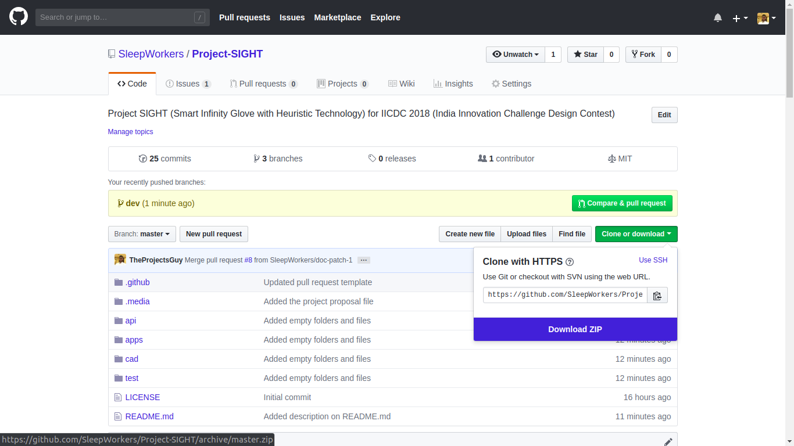

# Table of contents
- [Table of contents](#table-of-contents)
- [Introduction](#introduction)
- [About Project](#about-project)
- [Cloning project](#cloning-project)
  - [Users](#users)
  - [Developers](#developers)
    - [Ubuntu users](#ubuntu-users)
- [File structure](#file-structure)

# Introduction
This repository is created for the purpose of participation in [IICDC 2018](https://innovate.mygov.in/india-innovation-challenge-design-contest-2018/) (India Innovation Challenge Design Contest). The project details _in short_ are summarized below:

|||
| ----- | ------ |
|**Project Name** | Project _SIGHT_ (Smart Infinity Glove using Heuristic Technology) - Transforming the way we live |
|**Submission ID** | 372888 |


# About Project
This project is created for the purpose of participation in [IICDC 2018](https://innovate.mygov.in/india-innovation-challenge-design-contest-2018/) (India Innovation Challenge Design Contest).

The human hand is the most versatile part of the body. We exploit its dexterity to provide a glove that can transcend today’s wearables by giving an organic feel while interacting with technology. We feeltoday,the most important and difficult to procure resources are time, money, health & safety. S.I.G.H.T. will safeguard these resources.

The project proposal file can be found [here](./.media/docs/372888_IICDC\ Proposal.pdf).

# Cloning project
## Users
To clone the project, you can simply click on the **Clone or Download** button in the top right and download the entire project as a ZIP.


## Developers
Before getting started, please go through the [contributing](./.github/CONTRIBUTING.md) guidelines.
You're suggested to clone this repository using the [git](https://git-scm.com/) tool which you can download [here](https://git-scm.com/downloads).
> **Tip**: Clone using [SSH](https://help.github.com/articles/connecting-to-github-with-ssh/) is a better idea.

### Ubuntu users
Open a terminal and do the following:
- _Install_ git
    ```bash
    sudo apt install git
    ```
- _cd_ into the directory where you want to clone
    ```bash
    cd ~
    ```
- _Clone_ the repository
  - Using SSH
    ```bash
    git clone git@github.com:SleepWorkers/Project-SIGHT.git
    ```
  - Using HTTPS
    ```bash
    git clone https://github.com/SleepWorkers/Project-SIGHT.git
    ```

# File structure
<!-- TODO: Create a file structure and add description for it -->

