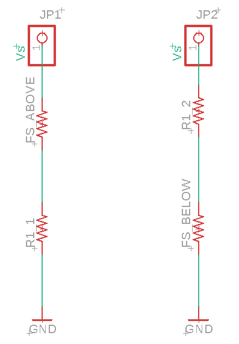
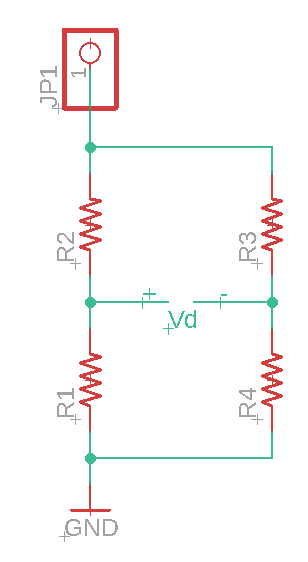
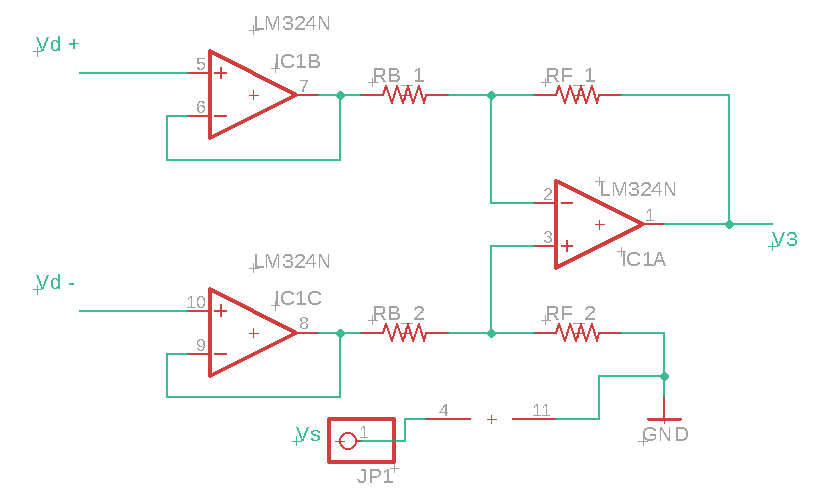
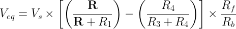
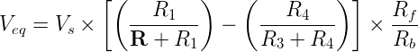
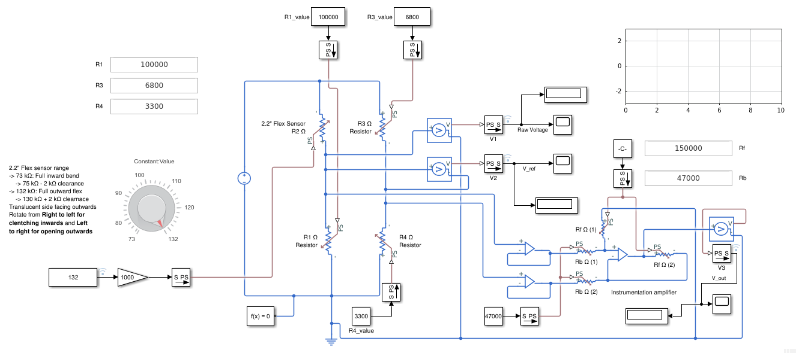
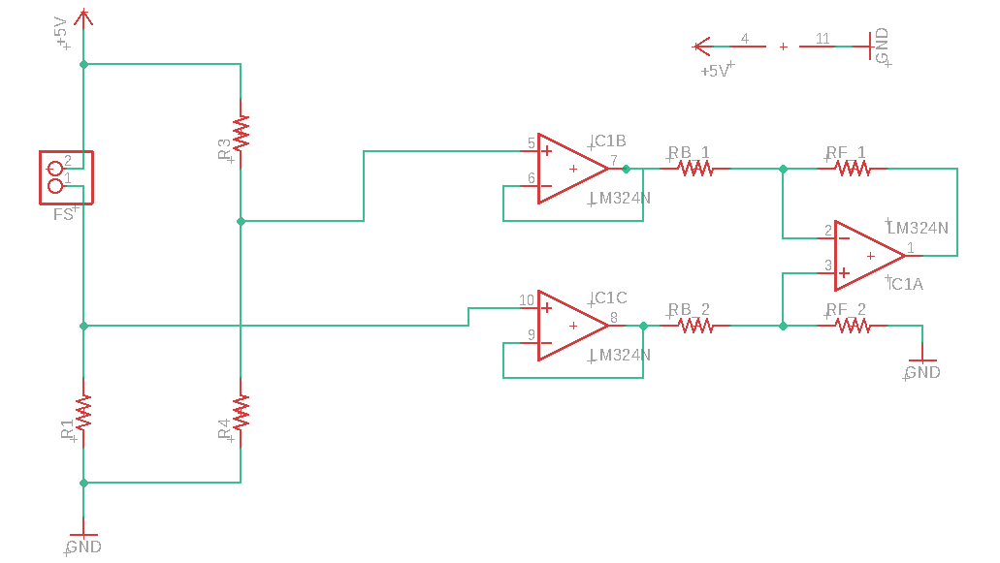

# What is this?
This is the directory for the flex sensor circuitry API.

This API helps you pick the best set of resistors from the set that you have for the flex sensor circuitry. The circuit is pre determined for this API, this API only predicts the best set of resistors for everything to work out as efficiently as possible. 

This API is written in the following platforms:
- [MATLAB](#matlab)

# Table of contents
- [What is this?](#what-is-this)
- [Table of contents](#table-of-contents)
- [Prerequisites](#prerequisites)
- [API Platforms](#api-platforms)
  - [MATLAB](#matlab)
    - [Using the API](#using-the-api)
      - [Sections of the output](#sections-of-the-output)
        - [Initializing the system](#initializing-the-system)
        - [Voltage divider analysis](#voltage-divider-analysis)
        - [Wheatstone bridge side arm analysis](#wheatstone-bridge-side-arm-analysis)
        - [Instrumentation Amplifier analysis](#instrumentation-amplifier-analysis)
        - [FINAL RESULTS](#final-results)


# Prerequisites 
You'll need the following to start using this API:
- Flex sensors 
  - We've used one `2.2 inch` and one `4.5 inch` in the given examples.
- Resistance of the flex sensors in the extreme flex conditions
  - To get this, perform the following steps for each flex sensor:
    1. Attach the flex sensor over your finger and connect a multimeter in resistance mode across the flex sensor to measure the resistance.
    2. Fold the finger inwards and take it to the maximum possible extreme. Measure the resistance now, this is called the `fif` resistance.
    3. Now, fold the finger outwards and take it to the maximum possible extreme. Measure the resistance now, this is called the `fof` resistance.
    4. If you placed the flex sensor with the resistance surface facing up, then `fif` resistance would be _greater_ than `fof` resistance. Otherwise, if the resistance surface was facing down, the `fof` resistance would be greater
- A set of resistor values from which the algorithm will pick the best ones.

Additionally, you'll need the following to completely build the circuit:
- **Three** _OP-AMPs_ to construct and instrumentation amplifier. We suggest using the [LM324][lm324-product_page] quad op-amp for this purpose.
- Information about the microcontroller that you'll be using for this application:
  - **Supply voltage** for the circuit. We call this `Vs` (which stands for _supply voltage_).
  - **Maximum input voltage for the ADCs** of the microcontroller. We call this `V_adc` (which stands for _maximum input voltage for the ADCs_).
- General electrical tools for making circuits.

[lm324-product_page]: http://www.ti.com/product/LM324

# API Platforms
Here are the platforms in which this API is written

## [MATLAB](./Flex_sensor_circuitry/MATLAB_API/)
The main file to check out here is [Final_tool.m][flex_sensor_circuit_api-matlab_final_tool] script. This is the main script that does all the work, but before that, some prerequisites are required. We have to give it some data as discussed in the [prerequisites section](#prerequisites).

Here are the things that you basically need to have for this API to work:
- `Final_tool.m` script [file](./MATLAB_API/Final_tool.m): This is the main script file, we'll explore it later, in the [usage](#using-the-api) section.
- `resistor_vals.mat` file: This is a file that has the following variables stored:
  - `resistor_values`: This is basically a columnar array consisting of the _resistor values_ that you have for the design. All the values are in kilo-ohms (**kΩ**). This is how you could create this:
    ```matlab
    resistor_values = [1; 1.5; 2.2; 3.3; 4.7; 5.6; 6.8; 8.2; 10; 15; 22; 33; 47; 56; 68; 100; 150; 220; 330; 470];
    ```
  - To create this file, you could run the following on the MATLAB command window:
    ```matlab
    save resistor_vals.mat resistor_values
    ```
    - Note that `resistor_values` is a column vector.
    - The `resistor_vals.mat` file created has only the `resistor_values` variable.
    - This file must be in the same directory as the `Final_tool.m` file, for the script to work properly.
- `sensor_readings.mat` file: This file contains everything about the flex sensors. It has the following variables stored:
  - `finger_names`: This is a columnar string array consisting of finger names (so that we can distinguish easily). This is how you can go about creating this:
    ```matlab
    finger_names = [
    "Thumb"
    "Index Finger"
    ];
    ```
  - `flex_sizes`: This is columnar cell array which specifies the sizes of the flex sensors. This is a cell array because of the `"` symbol standing for _inches_. This is how you can go about creating this:
    ```matlab
    flex_sizes = {
    '2.2"'
    '4.5"'
    };
    ```
  - `full_in_flex`: This is a columnar array consisting of resistance values for maximum inward flex, discussed as `fif` in the [prerequisites section](#prerequisites). All the values are in kilo-ohms (**kΩ**). This is how you can go about creating this:
    ```matlab
    full_in_flex = [
    73
    26
    ];
    ```
  - `full_out_flex`: This is a columnar array consisting of resistance values for maximum outward flex, discussed as `fof` in the [prerequisites section](#prerequisites). All the values are in kilo-ohms (**kΩ**). This is how you can go about creating this:
    ```matlab
    full_out_flex = [
    132
    7.5
    ];
    ```
  - `supply_voltage`: This is basically the supply voltage for the circuitry, discussed as `Vs` in the [prerequisites section](#prerequisites). The value is in volts (**V**). This is how you can go about creating this:
    ```matlab
    supply_voltage = 5;
    ```
  - `adc_max_input`: This is the maximum input voltage that we can give the ADCs of the microcontroller, discussed as `V_adc` in the [prerequisites section](#prerequisites). The value is in volts (**V**). This is how you can go about creating this:
    ```matlab
    adc_max_input = 4.95;
    ```
  - In the end, you can save all the above variables into the file using this:
    ```matlab
    save sensor_readings.mat finger_names flex_sizes full_in_flex full_out_flex supply_voltage adc_max_input
    ```

> **Note**: The number of rows in variables should be equal to the number of flex sensors.

> **Note**: The files [resistor_vals.mat](./MATLAB_API/resistor_vals.mat) and [sensor_readings.mat](./MATLAB_API/sensor_readings.mat) already existing are made using the above values (default values), you can use your own as well. If both those files are not present, then they're automatically created by the program with the default values. These values can be observed in the [Final_tool.m](./MATLAB_API/Final_tool.m) script.


### Using the API
- Run the script by running the following on the command window of MATLAB:
    ```matlab
    Final_tool
    ```
    Make sure that you run it in the same folder as the script.

#### Sections of the output
Let's explore and understand the output generated. For simplicity, the output is generated section wise.

##### Initializing the system
It tells you the data the script could read. It also tells you if the `resistor_vals.mat` and `sensor_readings.mat` have been found and parsed successfully.

##### Voltage divider analysis
Here the following things happen:
- First, a one by one analysis of flex sensors is performed. 
  - The algorithm automatically decides if the flex sensor must be placed _above_ or _below_ in the voltage divider circuit. In the image below, the voltage divider to the left has the flex sensor _above_ and _R1_ below in the voltage divider and the one on the right has the vide versa. 
    
- It then picks a resistor that gives the best voltage deviation (`R1_1` and `R1_2` in the above diagram) and generates a result table.
- This table summarizes everything. The column named `r1_kohm` is the column specifying **R1** values (in **kΩ**) for the voltage divider. This is the companion resistor to the flex sensor in the voltage divider. If the flex sensor is above, then this is below and vice versa.
  - The `above_pos` column says if the flex sensor is _above_ (1) or _below_ (0).
 
> **Note**: For the rest of this documentation, we'll build the circuitry with the flex sensor on the _above_ position. But, the same methods apply for the _below_ configuration as well.

> **Note**: The flex sensor is also denoted as `R2` for the rest of this documentation.

> **Note**: The `JP1` and `JP2` pins in the figure get the supply voltage `Vs`.


##### Wheatstone bridge side arm analysis
Here, we'll build the wheatstone bridge. 
- The resistors on the other arm of the wheatstone bridge are called **R3** (upper resistor) and **R4** (lower resistor). 
    
- The script chooses these values to get a voltage just lower than the minimum voltage in the voltage divider circuit. 
- The values given by the program are in kilo-ohms (**kΩ**)
- The program also gives the range of differential voltages (from `min_dv` to `max_dv`) and also the difference/range (in `dev_dv` column).

##### Instrumentation Amplifier analysis
Here, we'll build the instrumental amplifier.
- The gain is decided based on maximum differential voltage (maximum in `max_dv` of table in previous section) and the `V_adc` value.
- The `Rf` value is the forward resistance of the instrumentation amplifier and `Rb` is the backward resistances of the amplifier.
- The `v3` values are the output of the amplifier and are given to the ADCs.
    

> **Note**: `RF_2` and `RF_1` have the same value as `Rf` and `RB_1` and `RB_2` have the same value as `Rb`. The values given by the algorithm are in kilo-ohms (**kΩ**).

##### FINAL RESULTS
This section summarizes everything.

If you have a resistance value, then the net voltage value is given by:
- If sensor position is **below**
    
- If sensor position is **above**
    


After everything is done, it must look like this


The final circuit is as follows

All files can be found in the [Eagle_CAD folder][eagle-cad-folder], more on the documentation [here][eagle-cad-folder-doc]

[eagle-cad-folder]: ./../../Eagle_CAD/
[eagle-cad-folder-doc]: ./../../Eagle_CAD/README.md#flexconnections


[![TheProjectsGuy developer shield][TheProjectsGuy-dev-shield]][TheProjectsGuy-dev-profile]

[TheProjectsGuy-dev-shield]: https://img.shields.io/badge/Dev-TheProjectsGuy-0061ff.svg
[TheProjectsGuy-dev-profile]: https://github.com/TheProjectsGuy