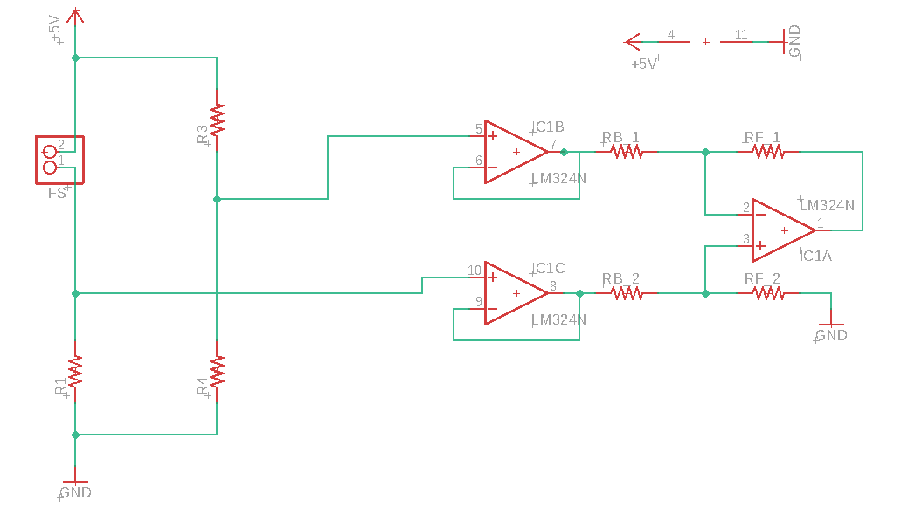

# What is this?
This folder contains CAD files for [issue 15](https://github.com/SleepWorkers/Project-SIGHT/issues/15).

# Table of contents
- [What is this?](#what-is-this)
- [Table of contents](#table-of-contents)
- [Files and folders](#files-and-folders)
  - [Flex\_CV\_interface](#flexcvinterface)
  - [Flex\_connections](#flexconnections)

# Files and folders
## [Flex\_CV\_interface](./Flex_CV_interface)
This folder contains files for the testing of the computer vision circuitry and the data collection algorithm part of [this issue](https://github.com/SleepWorkers/Project-SIGHT/issues/22). The files that are used for this are:

| **File Name** | **Purpose** |
| ---- | ---- |
| [*LED_connections.sch*](./Flex_CV_interface/LED_connections.sch) | The LED connections to be made. Check Figure 1 (below) |

**Figure 1**: The LED connections to be made.

## [Flex\_connections](./Flex_connections/)
The flex sensor connections for the circuit. This is aligned with the API to generate the circuitry.

| **File Name** | **Purpose** |
| ---- | ---- |
| [Final_circuit.sch](./Flex_connections/Final_circuit.sch) | The final circuitry (template) |

[![TheProjectsGuy developer shield][TheProjectsGuy-dev-shield]][TheProjectsGuy-dev-profile]
[![Spawning Issue #22][issue-shield]][issue-link]

[TheProjectsGuy-dev-shield]: https://img.shields.io/badge/Dev-TheProjectsGuy-0061ff.svg
[TheProjectsGuy-dev-profile]: https://github.com/TheProjectsGuy
[issue-shield]: https://img.shields.io/badge/Issue-%2315-f49842.svg
[issue-link]: https://github.com/SleepWorkers/Project-SIGHT/issues/15
