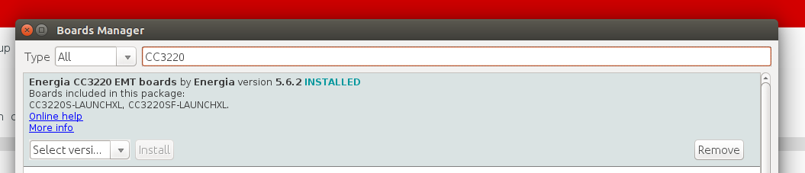
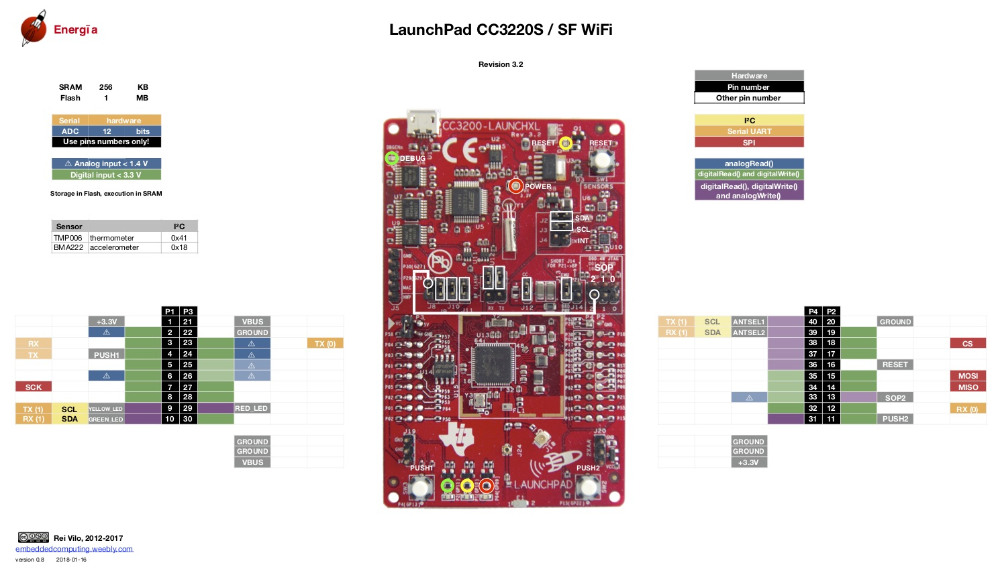

# What is this?
This is the testing directory of TI LaunchPad CC3220SF EVM Kit. All the codes written for it are present here.

# Table of contents
- [What is this?](#what-is-this)
- [Table of contents](#table-of-contents)
- [Files and Folders](#files-and-folders)
- [Softwares used](#softwares-used)
  - [Energia](#energia)
    - [Getting Started](#getting-started)
    - [Examples](#examples)
    - [Codes](#codes)
  - [Code Composer Studio](#code-composer-studio)
    - [Examples](#examples-1)
  - [TI Cloud Tools](#ti-cloud-tools)
- [Resources](#resources)
  - [CC3220SF LaunchPad](#cc3220sf-launchpad)
  - [Energia](#energia-1)
  - [Code Composer Studio](#code-composer-studio-1)
  - [TI Cloud Tools](#ti-cloud-tools-1)

# Files and Folders
This information can be perceived from further sections of this page.

# Softwares used
We've used the following software for our application

## Energia
Energia is an IDE built on Arduino and is specially for developers who're familiar with Arduino IDE but want to use TI products. You can find everything on their official website [here](http://energia.nu/). It's simple and easy to learn.

### Getting Started
To get started, do the following
- [Download](http://energia.nu/download/) Install Energia IDE as instructed [here](http://energia.nu/guide/) (choose your operating system there). All links are present in the [resources section](#resources).
- Open Energia and install the CC3220SF board
  - Go to **Tools** -> **Board** -> **Boards Manager...**
  - Search for `CC3220SF` and install `Energia CC3220SF EMT boards` package by *Energia*. Make sure that you have a stable internet connection.
  - Once the installation is done, it must look like this
    
- Connect the board, select the correct port and board under **Tools** -> **Board** and **Port**
- Upload the code under **File** -> **Examples** -> **01. Basics** -> **Blink** and see the results.
  - The red LED at D10 (bottom right of the board) must start blinking.
- Next, open a new window and try the [Blinks.ino][Energia-Examples-Blinks] code. Upload it, and open the serial monitor when done. There are more examples, check the examples section for all of them.

The pinout of the board can be found in the resources section

### Examples
Here are all the example codes

| **Code Name** | **Purpose** |
| ---- | ---- |
| [Blinks][Energia-Examples-Blinks] | To cycle between the three color LEDs and printing out messages on a serial monitor |

[Energia-Examples-Blinks]: ./Energia_examples/Blinks/Blinks.ino

### Codes
The actual codes used for this project are listed here. They're stored in a separate folder named [**Energia**](./Energia/)

| **File Name** | **Purpose** |
| ---- | ---- |
| [*Final_code.ino*](./Energia/Final_code.ino) | The final code to be uploaded to the microcontroller for **data capturing session** |

## Code Composer Studio
We've also used Code Composer Studio to program the board. In order to do the same, please follow the following steps:

1. Download and install the latest version of Code Composer Studio (links in the [resources section of this page](#code-composer-studio-1)). 
2. _Launch_ the Code Composer Studio application. It is suggested that you maintain a different workspace for this application.
3. Open the _Resource Explorer_. This can be found under **View** -> **Resource Explorer**.
4. Search for `CC3220SF LaunchPad`.
5. Download and install the following _Software_:
    - SimpleLink CC32xx SDK
    - SimpleLink SDK Plugins
    - Energia
6. Restart Code Composer Studio after all the software has been set up.
7. You're suggested to make a separate workspace for the tutorials (mainly examples) described in this page. Name it `CC3220SF_Basics`.

> **Tip**: Please ensure that you've installed the drivers for Windows as well as Linux platforms so that you can interface with your board.

### Examples
Examples for Code Composer Studio are a little more sophisticated, so we've created a little more descriptive documentation for those. Here are the examples we've created for `TI Wireless SimpleLink WiFi C3220SF MCU`:

| **Example Name** | **Topics** | **Description** |
| ---- | ---- | ------ |
| [*CircularBlink*](./CCSv8_examples#circularblink) | GPIO; Interrupts | Cycle through the debugger LEDs of the board using the switches | 
| [*CircularFade*](./CCSv8_examples#circularfade) | GPIO; PWM; Interrupts | Same as CircularBlink, but the LEDs fade here instead of blinking |
| [*SimpleMultimeter*](./CCSv8_examples#simplemultimeter) | PWM; UART (Serial); ADCs | A simple miltimeter made using an ADC and displaying it on serial monitor and LEDs |

## TI Cloud Tools
The TI Cloud tools are available at [this](https://dev.ti.com/) website. Once you reach there, you may be asked to install the TI Cloud Agent. It is important so that the website can interface with the board connected.

# Resources
## CC3220SF LaunchPad
- **Official Website**: [ti/CC3220SF-LAUNCHXL][cc3220sf-Website]
- **Buy** from: [TI Store][cc3220sf-buy-ti_store]; [Tanotis][cc3220sf-buy-tanotis]
- **Datasheets** and **Reading Material**
  - [User Guide][cc3220sf-user_guide]
  - [Data sheet][cc3220sf-datasheet]
  - [Out-of-Box Application][cc3220sf-out_of_box_doc]
  - [CC3220SF LaunchXL **Energia** Pinout](http://energia.nu/pinmaps/cc3220sf-launchxl/)
- **Wiki**: [wiki.ti/CC3120 & CC3220][cc3220sf-ti_wiki]
- **TI RTOS**
  - [SimpleLink MCU SDK Driver][ccs3220sf-tirtos-api-docs]

[ccs3220sf-tirtos-api-docs]: http://dev.ti.com/tirex/content/simplelink_cc32xx_sdk_2_40_02_00/docs/tidrivers/doxygen/html/index.html
[cc3220sf-ti_wiki]: http://processors.wiki.ti.com/index.php/CC3120_%26_CC3220
[cc3220sf-out_of_box_doc]: http://www.ti.com/lit/ug/swru473a/swru473a.pdf
[cc3220sf-datasheet]: http://www.ti.com/lit/pdf/swas035
[cc3220sf-website]: http://www.ti.com/tool/CC3220SF-LAUNCHXL
[cc3220sf-buy-ti_store]: https://www.ti.com/store/ti/en/p/product/?p=CC3220SF-LAUNCHXL&HQS=epd-mcu-simp-slmcu-pr-storeevm-cc3220-tw
[cc3220sf-buy-tanotis]: https://www.tanotis.com/products/texas-instruments-cc3220sf-launchxl-development-kit-simplelink-trade-wi-fi-reg-cc3220sf-launchpad-256kb-of-ram-enhanced-security-features?gclid=Cj0KCQiAtbnjBRDBARIsAO3zDl8s9y9HivqBG4KFEib-s_GI1bvbnzsRK1MmtcFR9M7jcDPUSLMoGl0aAtyLEALw_wcB
[cc3220sf-user_guide]: http://www.ti.com/lit/pdf/swru463

## Energia
- **Official Website**: [energia.nu](http://energia.nu/)
- **Download**: [Energia/Download](http://energia.nu/download/)
- **Language Reference**: [Energia Language Reference](http://energia.nu/reference/)
- **Boards**
  - [Pin maps](http://energia.nu/pinmaps/)
  - [CC3220SF LaunchXL Pinout](http://energia.nu/pinmaps/cc3220sf-launchxl/)
- **Guides**
  - [Boards](http://energia.nu/guide/boards/)
  - [Environment](http://energia.nu/guide/environment/)
  - Installation
    - [Linux](http://energia.nu/guide/install/linux/)
    - [MacOS](http://energia.nu/guide/install/macos/)
    - [Windows](http://energia.nu/guide/install/windows/)
- **Libraries**: [Core Libraries](http://energia.nu/guide/libraries/)

## Code Composer Studio
- **Official Website**: [TI/CCSTUDIO](http://www.ti.com/tool/CCSTUDIO)
- **Download**: [TI/CCSTUDIO/Download](http://processors.wiki.ti.com/index.php/Download_CCS)
- **Installation Instructions**
  - [Windows][ccs-install-windows]
  - [MacOS][ccs-install-macos]
  - [Linux][ccs-install-linux]
- [**User's Guide**][ccs-users-guide-unofficial]

[ccs-install-linux]: http://software-dl.ti.com/ccs/esd/documents/ccsv8_linux_host_support.html
[ccs-install-windows]: http://processors.wiki.ti.com/index.php/System_Requirements#Code_Composer_Studio_v8
[ccs-install-macos]: http://processors.wiki.ti.com/index.php/MacOS_Host_Support_CCSv8
[ccs-users-guide-unofficial]: https://www.eit.lth.se/fileadmin/eit/courses/eti121/References/ccs.pdf

## TI Cloud Tools
- **Official Website**: [dev.ti.com](https://dev.ti.com/)

[![TheProjectsGuy developer shield][TheProjectsGuy-dev-shield]][TheProjectsGuy-dev-profile]

[TheProjectsGuy-dev-shield]: https://img.shields.io/badge/Dev-TheProjectsGuy-0061ff.svg
[TheProjectsGuy-dev-profile]: https://github.com/TheProjectsGuy

