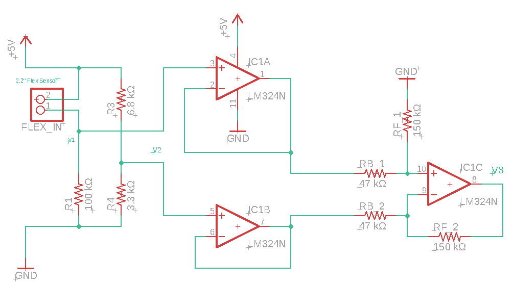
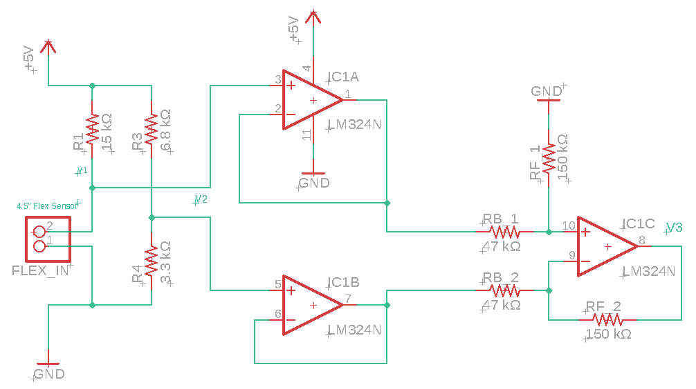
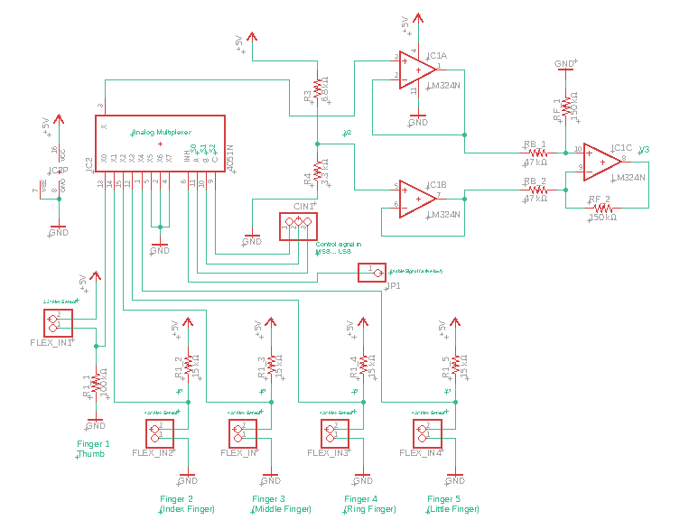

# What is this?
This is where all the Electronic CAD files for testing phase are stored.

# Table of contents
- [What is this?](#what-is-this)
- [Table of contents](#table-of-contents)
- [Materials used](#materials-used)
  - [Main items](#main-items)
  - [Generic items](#generic-items)
    - [Resistors](#resistors)
- [Folders and files](#folders-and-files)
  - [FlexSensor_v1](#flexsensorv1)
  - [FlexSensor_v2](#flexsensorv2)
    - [Flex sensor circuitry](#flex-sensor-circuitry)

# Materials used
Here are the materials required for the circuitry shown in CAD files

## Main items
| **Name** | **Resources** | **Number of items** | **Purpose** |
| ----- | :---- | :----: | :----- |
| `2.2" Flex sensor` | [purchase][flex_2.2in-buy_link]  | 1 | Measure the flex of thumb (2 joint fingers) |
| `4.5" Flex sensor` | [purchase][flex_4.5in-buy_link] | 4 | Measure the flex of index, middle, ring and little finger (3 joint fingers) |
| `LM324N Quad OpAmp` | [purchase][lm324n-buy_link]; [datasheet][lm324n-datasheet] | 1 | To build an instrumentation amplifier |
| `74HC4051 Amalog multiplexer` | [purchase][74hc4051-buy_link]; [datasheet][74hc4051-datasheet] | 1 | Analog multiplexer for selecting the flex sensor |

<!-- Links section -->
[74hc4051-datasheet]: http://www.ti.com/lit/ds/symlink/cd74hc4051-ep.pdf
[74hc4051-buy_link]: https://www.tanotis.com/products/sparkfun-sparkfun-multiplexer-breakout-8-channel-74hc4051
[flex_4.5in-buy_link]: https://robu.in/product/flex-sensor-4-5/?gclid=CjwKCAiAhp_jBRAxEiwAXbniXQzzboUtXNm8b1UfSavZsXq-mlRN1pX-zzk6p8WMsIwrLN4VyW_e9xoCwXoQAvD_BwE
[flex_2.2in-buy_link]: https://robu.in/product/flex-sensor-2-2-bend-sensor-hand-gesture-recognition/?gclid=CjwKCAiAhp_jBRAxEiwAXbniXT2jKtnzok35Y8mCeqd8ppJJEC4jkzGg5mqVCgCvT5seHRLAErGYdxoCqq8QAvD_BwE
[lm324n-buy_link]: https://www.tanotis.com/products/texas-instruments-lm324n-operational-amplifier-quad-1-2-mhz-4-amplifier-0-5-v-micro-s-3v-to-32v-plusmn-1-5v-to-plusmn-16v-dip
[lm324n-datasheet]: http://www.ti.com/lit/ds/symlink/lm324-n.pdf

## Generic items
### Resistors
| **Value** | **Number of items** | **Symbol** | **Purpose** |
| :---- | :----: | :----: | ----- |
| `100 kΩ` | 1 | **R1** | For the 2.2" flex sensor |
| `6.8 kΩ` | 1 | **R3** | For the wheatstone bridge |
| `3.3 kΩ` | 1 | **R4** | For the wheatstone bridge |
| `150.0 kΩ` | 2 | **Rf** | For forward resistor in instrumentation amplifier |
| `47.0 kΩ` | 2 | **Rb** | For backward resistor in instrumentation amplifier |

# Folders and files
Everything stored in the [SIGHT](./SIGHT/) folder. It's an entire eagle project, so it's suggested that you open it using [Autodesk Eagle](https://www.autodesk.com/education/free-software/eagle).

## [FlexSensor_v1](./SIGHT/FlexSensor_v1/)
First trial of the project. This has been discontinued due to [this issue](https://github.com/SleepWorkers/Project-SIGHT/issues/16).

## [FlexSensor_v2](./SIGHT/FlexSensor_v2/)
Second trial of project. It contains files for the following

### Flex sensor circuitry
- [Simple_2in2_flex.sch](./SIGHT/FlexSensor_v2/FlexSensor_v2/Simple_2in2_flex.sch): Only 2.2" flex sensor circuitry
    
- [Simple_4in5_flex.sch](./Electronic_CAD_files/SIGHT/FlexSensor_v2/FlexSensor_v2/Simple_4in5_flex.sch): Only 4.5" flex sensor circuitry
    
- [Final_circuitry_v1.sch](./Electronic_CAD_files/SIGHT/FlexSensor_v2/FlexSensor_v2/Final_circuitry_v1.sch): Final circuitry (**version 1**) consisting of analog multiplexer and control signals.
    

[![TheProjectsGuy developer shield][dev_shield]][dev_link]

[dev_shield]: https://img.shields.io/badge/Dev-TheProjectsGuy-0061ff.svg
[dev_link]: https://github.com/TheProjectsGuy
