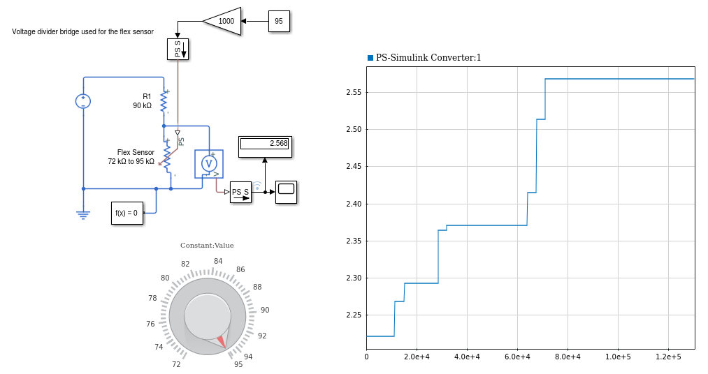
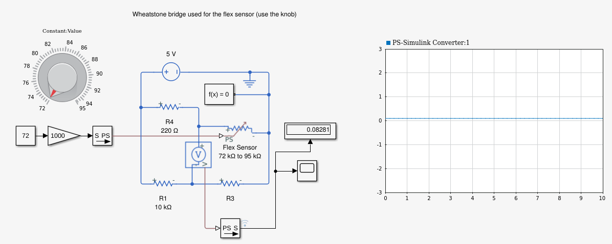

# What is this ?
All MATLAB test files are stored in this directory

# Table of contents
- [What is this ?](#what-is-this)
- [Table of contents](#table-of-contents)
- [Folders](#folders)
  - [Simulink](#simulink)

# Folders
Information about all the folders is present below

## Simulink
All [Simulink](https://www.mathworks.com/products/simulink.html) files are present below:
- [FlexSensor_voltage_divider.slx](./Simulink/FlexSensor_voltage_divider.slx): Simple voltage divider circuit for converting the flex stress into voltage change.
  - This gave unsatisfactory results
    
- [FlexSensor_Wheatstone_Bridge1.slx](./Simulink/FlexSensor_Wheatstone_Bridge1.slx): Wheatstone bridge used to convert stress into voltage values
  - This also did not give very satisfactory results.
    

