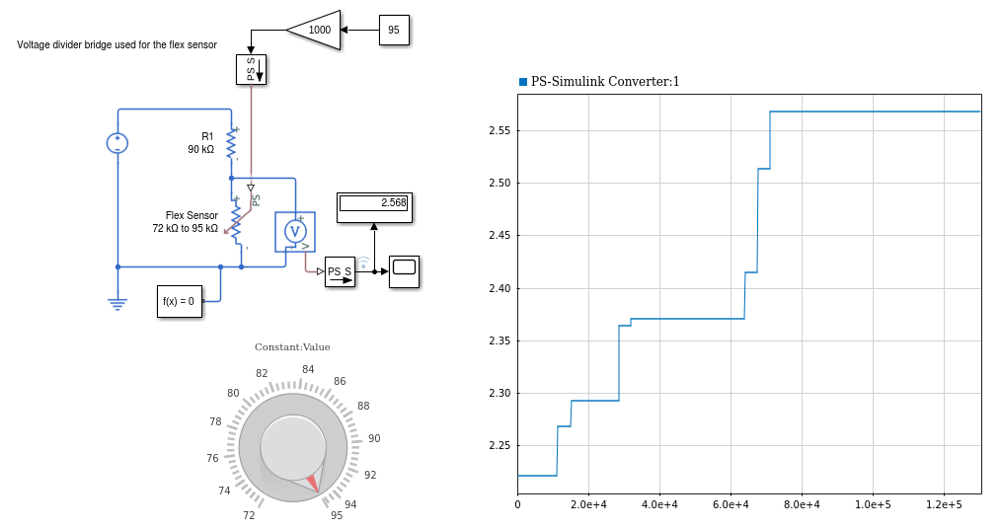
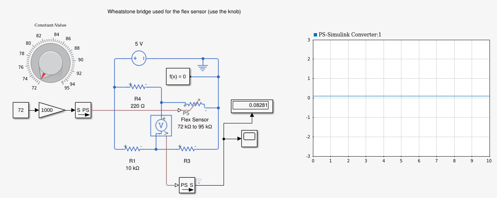
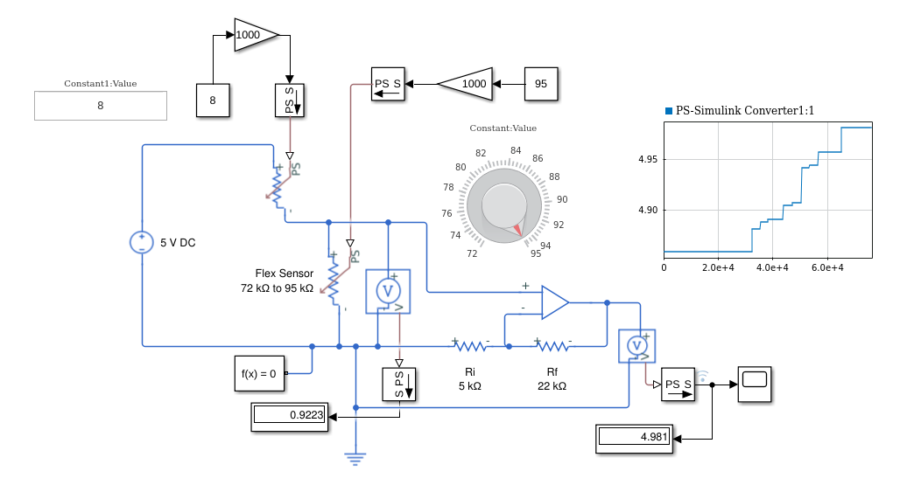
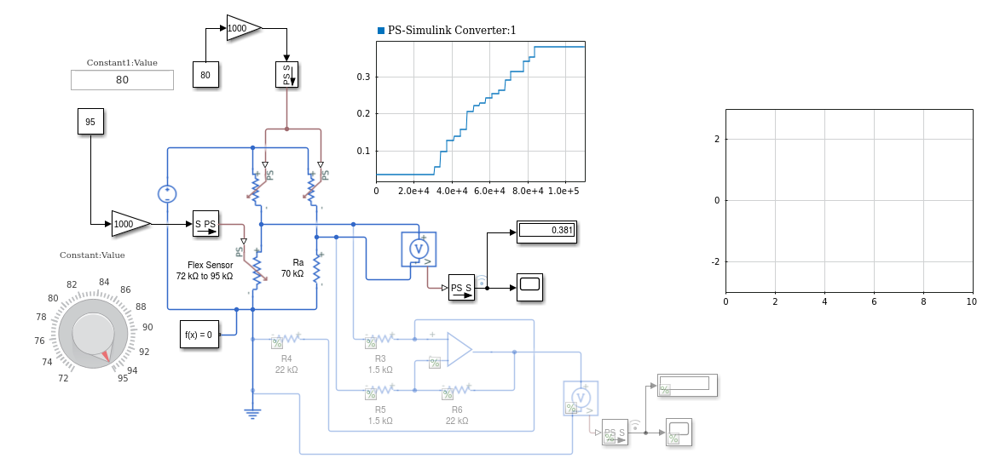
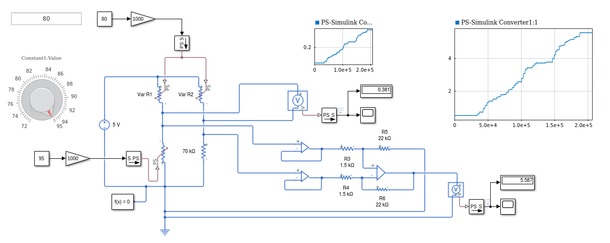
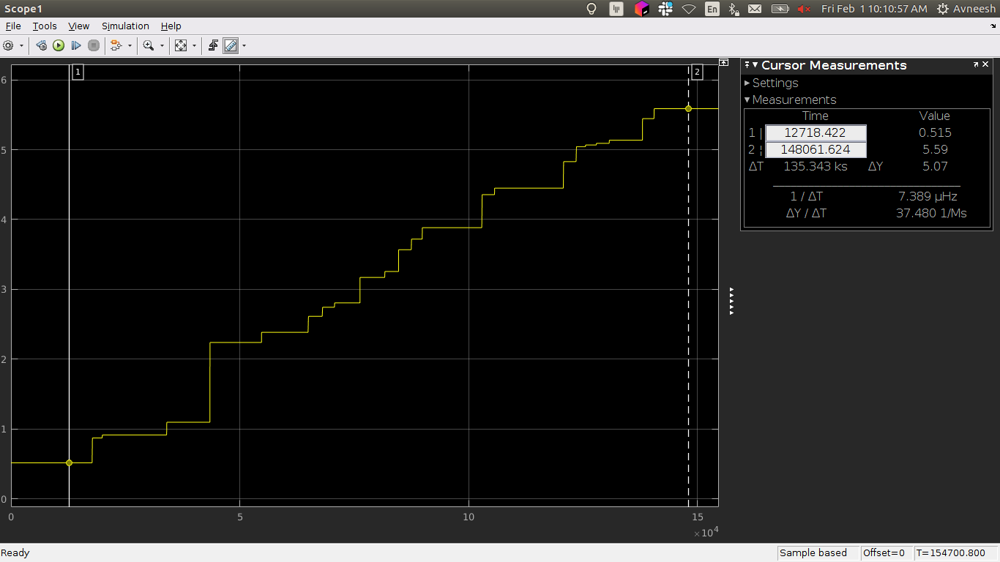
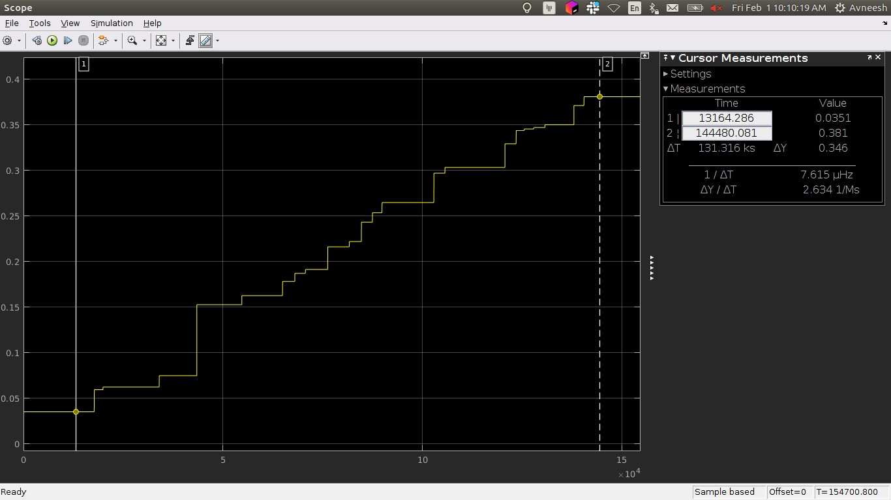
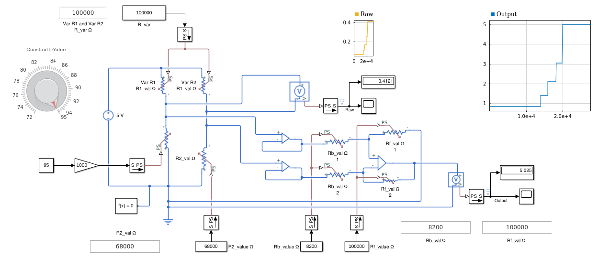

# What is this ?
All MATLAB test files in version 1 are stored in this directory

:warning: This version has been discontinued, please check Version 2. More information [here](https://github.com/SleepWorkers/Project-SIGHT/issues/16#issuecomment-460722749) :warning:

# Table of contents
- [What is this ?](#what-is-this)
- [Table of contents](#table-of-contents)
- [Dependencies](#dependencies)
- [Folders](#folders)
  - [Simulink Files](#simulink-files)
    - [Flex Sensor](#flex-sensor)

# Dependencies
These tests have used the following MATLAB dependencies.

| **Package Name** | **Purpose** | **Link** |
| ---- | ---- | ---- | 
| MATLAB | The core MATLAB package | [here](https://in.mathworks.com/products/matlab.html) |
| Simulink | For simulation purposes | [here](https://in.mathworks.com/products/simulink.html) |
| Simscape | For simulation of electronic circuits | [here](https://in.mathworks.com/products/simscape.html) |
| Simscape Electrical | Electrical simulation | [here](https://in.mathworks.com/products/simscape-electrical.html) |

# Folders
Information about all the folders is present below

## [Simulink Files](./Simulink/)
All [Simulink](https://www.mathworks.com/products/simulink.html) files are present below:

### Flex Sensor
- [FlexSensor_voltage_divider.slx](./Simulink/FlexSensor_voltage_divider.slx): Simple voltage divider circuit for converting the flex stress into voltage change.
  - This gave unsatisfactory results
    
  - Specifications:
    - The resistor R1 resistance is 90 kΩ
    - The flex sensor range is 72 kΩ to 95 kΩ
- [FlexSensor_Wheatstone_Bridge1.slx](./Simulink/FlexSensor_Wheatstone_Bridge1.slx): Wheatstone bridge used to convert stress into voltage values
  - This also did not give very satisfactory results.
    
- [FlexSensor_OpAmp1.slx](./Simulink/FlexSensor_OpAmp1.slx): The first iteration in which an OpAmp is used. It didn't show appreciable results.
  - Showed depressing results (low gain)
    
  - Maybe use a wheatstone bridge in the next iteration.
- [FlexSensor_OpAmp2.slx](./Simulink/FlexSensor_OpAmp2.slx): Introduction to using ideal OpAmps for system modeling
  - It was moderately good
    
  - The output was **0.346 V** in voltage deviation. It is suggested to use an impedance matching circuit and have an analog mux to selectively read from the sensors at a high speed.
- [FlexSensor_OpAmp3.slx](./Simulink/FlexSensor_OpAmp3.slx): Used an instrumentation amplifier to obtain good results in deviation. The results are acceptable.
  - Very good results obtained, good enough to move to the next stage.
    
  - OpAmp output variation as shown below (these are different from the ones shown in the image describing the circuit)
    
    - These readings are for the following inputs (these are different from the ones shown in the image describing the circuit)
        
- [FlexSensor_Customizable_2in2.slx](./Simulink/FlexSensor_Customizable_2in2.slx): Made a customizable circuit design for the 2.2" flex sensor (for thumb circuitry only).
    

The final model is in `Flex_Sensor_final_circuitry.slx`.

> **Note**: The files in the `Simulink` [folder](./Simulink/) are for the version **R2017b**. There are more versions in the [versions folder](./Simulink/Versions/).

