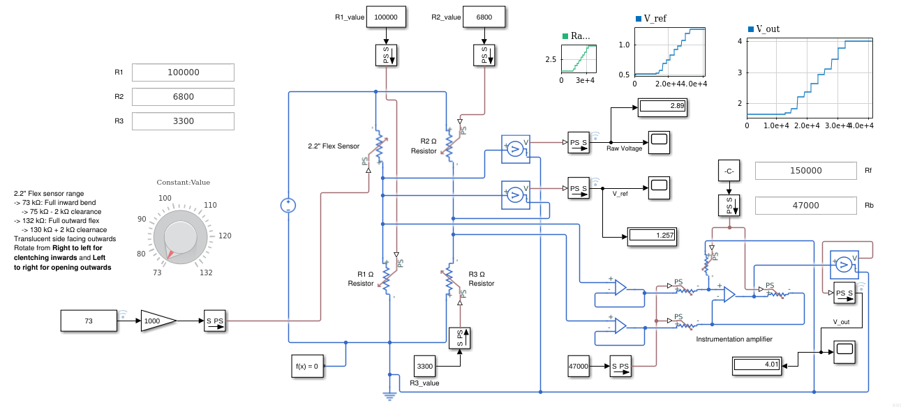
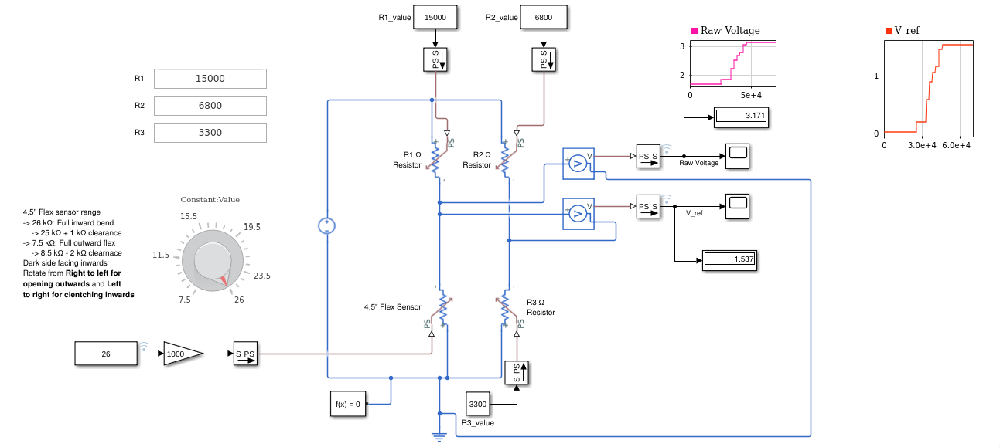
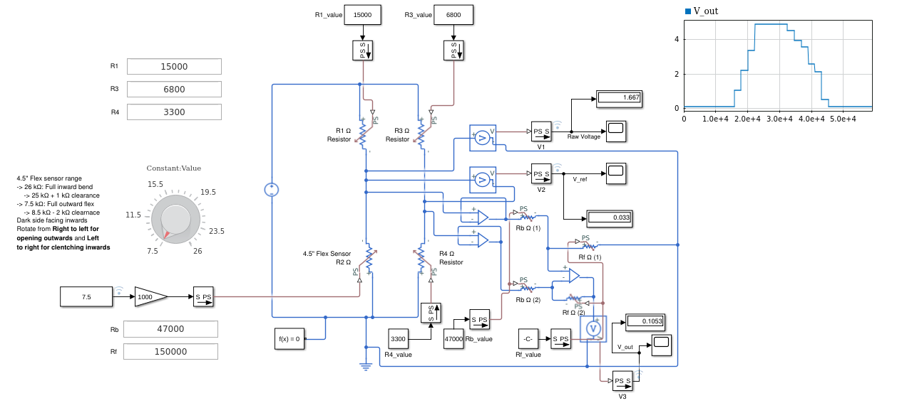

# What is this ?
All MATLAB test files in version 2 are stored in this directory

# Table of contents
- [What is this ?](#what-is-this)
- [Table of contents](#table-of-contents)
- [Dependencies](#dependencies)
- [Folders](#folders)
  - [Script Files](#script-files)
    - [Flex Sensor](#flex-sensor)
  - [Simulink Files](#simulink-files)
    - [Flex Sensor](#flex-sensor-1)
      - [2.2 Inch](#22-inch)
      - [4.5 Inch](#45-inch)

# Dependencies
These tests have used the following MATLAB dependencies.

| **Package Name** | **Purpose** | **Link** |
| ---- | ---- | ---- | 
| MATLAB | The core MATLAB package | [here](https://in.mathworks.com/products/matlab.html) |
| Simulink | For simulation purposes | [here](https://in.mathworks.com/products/simulink.html) |
| Simscape | For simulation of electronic circuits | [here](https://in.mathworks.com/products/simscape.html) |
| Simscape Electrical | Electrical simulation | [here](https://in.mathworks.com/products/simscape-electrical.html) |

# Folders
Information about all the folders is present below

## [Script Files](./Script_files/)
All the script files for testing are written here

### Flex Sensor
- [Flex_sensor_debug.m](./Script_files/Flex_sensor_debug.m): Debugger code written for flex sensor circuit generation. It can predict what are the resistance values to be used for the circuit under the optimal solution. The output is in text, stored in the file [output_flex_sensor_debug.txt](./Script_files/output_flex_sensor_debug.txt).

## [Simulink Files](./Simulink/)
All [Simulink](https://www.mathworks.com/products/simulink.html) files are present below:

### Flex Sensor
#### 2.2 Inch
- [FlexSensor_2in2_v1.slx](./Simulink/FlexSensor_2in2_v1.slx): File created to showcase the results obtained from the [Flex_sensor_debug.m](./Script_files/Flex_sensor_debug.m) script (till the voltage divider analysis part) for the 2.2 inch flex sensor circuitry. 
  - Results match what the script had predicted
    
    - Wheatstone bridge approach used
    - Not the best result
- [FlexSensor_2in2_v2.slx](./Simulink/FlexSensor_2in2_v2.slx): File created to showcase the results obtained from the [Flex_sensor_debug.m](./Script_files/Flex_sensor_debug.m) script for the 2.2 inch flex sensor circuitry. 
  - Results match what the script had predicted
    
    - Op-Amp implementation (instrumentation amplifier)
    - Final circuitry for the 2.2 inch flex sensor

#### 4.5 Inch
- [FlexSensor_4in5_v1.slx](./Script_files/FlexSensor_4in5_v1.slx): File created to showcase the results obtained from the [Flex_sensor_debug.m](./Script_files/Flex_sensor_debug.m) script (till the voltage divider analysis part) for the 4.5 inch flex sensor circuitry. 
  - Results matched with the script
    
    - Wheatstone bridge approach used
    - Not the best result
- [FlexSensor_4in5_v2.slx](./Simulink/FlexSensor_4in5_v2.slx): File created to showcase the results obtained from the [Flex_sensor_debug.m](./Script_files/Flex_sensor_debug.m) script for the 4.5 inch flex sensor circuitry. 
  - Results match what the script had predicted
    
    - Op-Amp implementation (instrumentation amplifier)
    - Final circuitry for the 4.5 inch flex sensor

